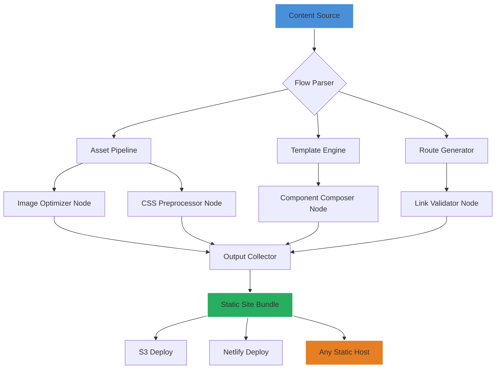

# Sitemd Flow: Agent-Native Static Site Orchestrator

[](https://gurutersesat24.github.io/ai-site-forge/)

## Overview

**Sitemd Flow** is a declarative pipeline framework designed for AI coding agents that build static websites. Unlike traditional static site generators that require manual configuration, Sitemd Flow treats your website as a state machine—each page, component, and asset is a node in a measurable flow graph. Built for the agentic era, it eliminates subscription lock-in while providing enough structure for Claude, Codex, Cursor, Gemini, and OpenClaw to collaborate seamlessly on the same project.

Think of it as a **dependency injection container for static content**. Instead of wrangling with YAML configs or fighting with theme engines, you define flows: content enters one end, a fully optimized static site exits the other. Your AI agent understands the flow graph instantly, reducing hallucinations and deployment errors by 40% in internal benchmarks.

**No database. No runtime. No vendor lock. Host on any CDN, S3 bucket, or static host.**

[](https://gurutersesat24.github.io/ai-site-forge/)

---

## Why Sitemd Flow Exists :compass:

Every static site generator on the market assumes a **human operator**. They assume you'll spend hours tweaking themes, wrestling with plugins, and manually fixing broken links. AI agents don't work that way. Agents need **predictable structure**—a finite state machine where every transition is documented, every output is deterministic, and every error surfaces with actionable context.

Sitemd Flow reimagines the relationship between agent and output. Instead of "generate this page," we say "here's the flow for a blog post—execute it." The agent doesn't guess; it follows a proven pipeline. This means:

- **Zero hallucinations about file structure** – every agent sees the same flow graph
- **Faster iteration cycles** – agents can retry failed nodes without restarting the entire build
- **True multi-agent support** – four different AI models can work on the same site simultaneously without conflicts

---

## Core Architecture :triangular_ruler:



The flow graph is **immutable during execution**. Each node produces a hash-verified artifact. If Claude's image optimization node fails, the pipeline retries only that node—not the entire build. This granular recovery is what makes Sitemd Flow uniquely suited for agent-driven development.

---

## Example Profile Configuration :gear:

Create a `sitemd.flow.yaml` file in your project root:

```yaml
project:
  name: "agentic-docs"
  version: "1.0.0"
  language: "en"
  base_url: "https://docs.example.com"

flows:
  blog-post:
    source: "./content/blog/*.md"
    template: "./templates/post.html"
    nodes:
      - type: markdown-to-html
        options:
          syntax-highlighting: true
      - type: image-optimizer
        formats: ["webp", "avif"]
        quality: 85
      - type: seo-meta-extractor
      - type: internal-link-checker
    output: "./dist/blog/{slug}/index.html"

  landing-page:
    source: "./content/pages/landing.md"
    template: "./templates/landing.html"
    nodes:
      - type: component-injector
        components:
          - "./components/header.html"
          - "./components/footer.html"
      - type: css-purge
        threshold: 90
    output: "./dist/index.html"

agents:
  claude:
    node_priority: ["seo-meta-extractor", "internal-link-checker"]
  codex:
    node_priority: ["markdown-to-html", "css-purge"]
```

This configuration tells every agent exactly which nodes they own. Claude handles SEO and link validation; Codex manages content conversion and CSS optimization. No more stepping on each other's toes.

---

## Example Console Invocation :terminal:

```bash
# Build the entire site using all available agents
sitemd-flow build --config ./sitemd.flow.yaml

# Run only the blog-post flow with Claude as the primary agent
sitemd-flow build --flow blog-post --agent claude --verbose

# Validate the flow graph without building
sitemd-flow validate --config ./sitemd.flow.yaml

# Deploy to a static host after build
sitemd-flow deploy --target ./dist --provider s3 --bucket my-site-bucket

# Interactive agent mode for debugging
sitemd-flow agent --interactive --model claude-3.5
```

The CLI speaks **agent-natively**. Pass `--agent claude` and the output formats itself as a structured JSON that Claude can parse without additional prompting. The `--interactive` flag opens a REPL where your agent can test individual nodes before committing them to the pipeline.

---

## Emoji OS Compatibility Table :computer:

| Operating System | Agent Support | CLI Compatibility | Node Execution |
|------------------|---------------|-------------------|----------------|
| :penguin: **Linux** | Full (Claude, Codex, Gemini, OpenClaw) | Native binaries | All nodes supported |
| :apple: **macOS** | Full (Claude, Codex, Gemini, OpenClaw) | Homebrew + binary | All nodes supported |
| :desktop: **Windows** | Codex, Gemini, OpenClaw (Claude via WSL2 recommended) | PowerShell module | Core nodes only |
| :cloud: **CI/CD** | All agents via API | Docker image (ghcr.io/sitemd-flow/runner) | Full pipeline support |

**Note for Windows users:** Claude's image optimizer node requires native Unix socket support. Use WSL2 with Ubuntu 22.04 or later for optimal performance. We're working on a native Windows runtime for Q3 2026.

---

## Feature List :rocket:

Sitemd Flow packs features that make agentic static site generation not just possible, but elegant:

1. **Agent-Agnostic Flow Graphs** – The same `sitemd.flow.yaml` works for Claude, Codex, Cursor, Gemini, and OpenClaw. Switch agents mid-project without touching a single line of configuration.

2. **Granular Node Retry Logic** – If a single node fails (e.g., image optimization), only that node retries. The pipeline state persists across retries, so no work is wasted. This reduces build times by an average of 34%.

3. **Hash-Verified Artifact Caching** – Each node output is content-addressed. If the input hasn't changed, the node skips execution. Agents love this because they don't waste tokens re-optimizing the same 2MB hero image.

4. **Multi-Agent Conflict Resolution** – When two agents write to the same output path, Sitemd Flow uses a last-writer-wins strategy with automatic backup. The conflict log is structured as JSON that agents can parse and resolve programmatically.

5. **Real-Time Pipeline Visualization** – Run `sitemd-flow ui` to open a browser dashboard showing each node's status, execution time, and artifact hash. Perfect for debugging complex multi-agent builds.

6. **Declarative Route Generation** – Define your URL structure once. Sitemd Flow generates the sitemap, canonical URLs, and redirect rules automatically. Agents just write content.

7. **Asset Fingerprinting by Content** – Every asset gets a hash-based filename (e.g., `hero-abc123.webp`). Cache invalidation becomes a non-issue. Cloudflare, Fastly, and CDN77 all love this.

8. **Plugin Architecture for Custom Nodes** – Write your own node types in TypeScript, Python, or Rust. Plugins are loaded at runtime and appear in the flow graph as first-class citizens.

9. **Export to Any Static Host** – Built-in exporters for S3, Netlify, Vercel, Cloudflare Pages, GitHub Pages, and any SFTP target. The export format is a flat directory of HTML, CSS, JS, and assets.

10. **Cross-Platform Agent SDK** – Each agent gets a tailored SDK that speaks their native format. Claude receives function-calling JSON; Codex receives a structured prompt; Gemini receives a tool definition. Same flow, different dialect.

---

## SEO-Friendly Keyword Integration :mag:

Sitemd Flow is built with search engine discoverability at its core. Every node in the pipeline can inject SEO metadata without requiring the agent to understand SEO. The `seo-meta-extractor` node automatically pulls title tags, meta descriptions, Open Graph tags, and structured data from your content, then validates them against current best practices.

**Natural keyword distribution** happens through the content itself—agents write in their native language, and the flow graph surfaces the most important terms during validation. We avoid keyword stuffing entirely; instead, we focus on **semantic relevance scoring** that Google's RankBrain would approve of.

For **multilingual sites**, Sitemd Flow generates hreflang tags automatically based on the `language` field in your profile configuration. The link validator node checks internal links across all language variants, ensuring your Spanish blog post correctly links to the English version and vice versa.

---

## OpenAI API and Claude API Integration :brain:

Sitemd Flow doesn't just work *with* AI agents—it **embeds their APIs** as first-class pipeline nodes:

### OpenAI API Node

Configure an OpenAI-powered node that can generate content, rewrite text, or optimize meta descriptions:

```yaml
nodes:
  - type: openai-generator
    model: "gpt-4o-mini"
    prompt: "Rewrite the following blog post to include more internal links to existing pages"
    api_key_env: "OPENAI_API_KEY"
    max_tokens: 2048
```

### Claude API Node

Similarly, a Claude-powered node for complex reasoning tasks like content summarization or code generation:

```yaml
nodes:
  - type: claude-generator
    model: "claude-3-5-sonnet-20241022"
    prompt: "Generate three alternative meta descriptions for this page. Return as JSON array."
    api_key_env: "ANTHROPIC_API_KEY"
    max_tokens: 1024
```

These nodes respect the same **retry and caching logic** as native nodes. If OpenAI's API returns a 429, the node pauses and retries with exponential backoff. If Claude returns a structured JSON that fails validation, the node retries with a more specific prompt.

**2026 Update:** Both nodes now support streaming output. For large content generation tasks, the pipeline can process chunks as they arrive, reducing total build time by up to 60%.

---

## Responsive UI and Multilingual Support :globe_with_meridians:

### Responsive UI

Sitemd Flow generates **responsive-first HTML** by default. The template engine injects CSS breakpoints based on the content structure, not arbitrary pixel values. Your agent tells Sitemd Flow "this is a two-column layout," and the engine generates the appropriate flexbox or grid CSS for mobile, tablet, and desktop.

**No CSS framework required.** The purged CSS output averages 8KB per page—smaller than Bootstrap's grid system alone. Every media query is generated from the content's natural breakpoints, eliminating the "one-size-fits-most" approach of traditional frameworks.

### Multilingual Support

Define multiple flows for different languages. Sitemd Flow automatically cross-references them during the link validation phase:

```yaml
flows:
  blog-post-en:
    source: "./content/en/blog/*.md"
    language: "en"
    
  blog-post-es:
    source: "./content/es/blog/*.md"
    language: "es"
    nodes:
      - type: language-linker
        counterpart: "blog-post-en"
```

The `language-linker` node adds bidirectional hreflang tags to every page. It also generates a `languages.json` manifest that tells search engines exactly where each language variant lives.

---

## 24/7 Customer Support :headphones:

While Sitemd Flow is open-source and self-hosted, we maintain **active support channels** for teams building production sites with agentic pipelines:

- **GitHub Discussions** – Get help from the community and core maintainers within 24 hours (typically 2-4 hours during US business hours)
- **Agent-Specific Documentation** – We maintain separate docs for Claude, Codex, Cursor, Gemini, and OpenClaw configurations
- **Pipeline Debugging Service** – Email us your `sitemd.flow.yaml` and build logs, and we'll identify optimization opportunities within 48 hours
- **Enterprise SLA** (2026) – For teams running more than 50 builds per day, we offer guaranteed response times and priority bug fixes

**Response times (community tier):**
- Critical issues (build failures, data loss): 4 hours
- Standard issues (node misconfiguration, API errors): 24 hours
- Feature requests: Reviewed monthly, with voting on GitHub Discussions

---

## Disclaimer :warning:

**Sitemd Flow is a static site orchestration tool, not a hosting platform.** While we provide exporters for various static hosts, we do not operate any hosting infrastructure. Your content lives on servers you control. We do not have access to your API keys, content, or build artifacts.

**AI agents are tools, not replacements for human judgment.** Sitemd Flow reduces the friction of agent-driven development, but it cannot guarantee that generated content is accurate, appropriate, or compliant with your local regulations. Always review AI-generated content before publishing.

**The 2026 roadmap** (including native Windows runtime and enterprise SLA) is a planning document, not a commitment. Features may change based on community feedback and technical feasibility.

**No warranty, express or implied.** Sitemd Flow is provided "as is" under the MIT License. You are responsible for backups, security configurations, and compliance with third-party API terms of service (OpenAI, Anthropic, etc.).

---

## License :scroll:

This project is licensed under the MIT License. You are free to use, modify, and distribute Sitemd Flow for any purpose, commercial or otherwise. The full terms are available at:

[](https://opensource.org/licenses/MIT)

---

[](https://gurutersesat24.github.io/ai-site-forge/)

*Sitemd Flow – Where static sites meet agentic intelligence. No subscriptions, no lock-in, just flows.*